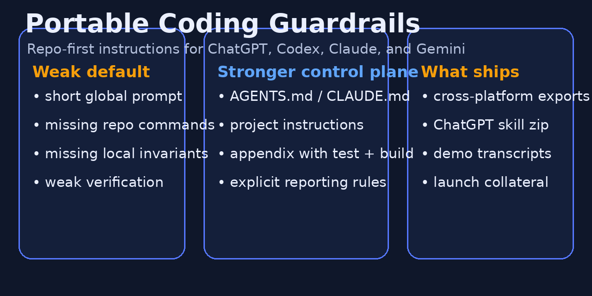

# Portable Coding Guardrails

Repo-first coding guardrails for ChatGPT, Codex, Claude, and Gemini.



Short account-global prompts do not carry repo commands, architecture constraints, test expectations, or local invariants well enough. Put the real control plane where the work happens.

## Deployment order

1. Repo-level files
2. Project-level instruction surfaces
3. Skills or Gems
4. One-shot bootstrap prompts
5. Account-global fallback

## Start here

| Platform | Best file | Default use |
|---|---|---|
| Codex | `exports/codex/AGENTS.md` | Repo commands, invariants, and verification rules |
| Claude Code | `exports/claude/CLAUDE.md` | Repo-local memory for code work |
| ChatGPT Projects | `exports/chatgpt/PROJECT_INSTRUCTIONS.md` | Project scope when repo files are unavailable |
| Claude Projects | `exports/claude/PROJECT_INSTRUCTIONS.md` | Project scope when repo files are unavailable |
| Gemini Gems | `exports/gemini/GEM_INSTRUCTIONS.md` | Portable behavior layer paired with repo docs |
| Any chat UI | `exports/any-llm/BOOTSTRAP_PROMPT.md` | Disposable first-message contract |
| Account-global fallback | `exports/chatgpt/GLOBAL_FALLBACK_SHORT.txt` | Emergency-only fallback |

## Problem

The common failure pattern is simple: a short global prompt is asked to carry test commands, lint rules, protected paths, architecture constraints, and local invariants across every coding task.

That is the wrong control plane.

Repo-specific behavior belongs in a repo file or a project instruction surface.

## Contents

```text
exports/     Platform-ready instruction files
skill/       Source for the ChatGPT skill bundle
templates/   Project appendix template
docs/        Install, proof, demo, launch, and review material
dist/        Packaged ChatGPT skill
```

## Quick install

### Codex
1. Copy `exports/codex/AGENTS.md` to the repo root as `AGENTS.md`.
2. Append the fields from `templates/PROJECT_APPENDIX.md`.
3. Fill in commands, critical paths, and invariants.

### Claude Code
1. Copy `exports/claude/CLAUDE.md` to the repo root as `CLAUDE.md`.
2. Append the fields from `templates/PROJECT_APPENDIX.md`.
3. Fill in the repo-specific appendix.

### ChatGPT Projects
1. Create a project.
2. Paste `exports/chatgpt/PROJECT_INSTRUCTIONS.md` into Project instructions.
3. Append the project appendix fields.

### ChatGPT Skill
Use `dist/skill.zip` when a reusable ChatGPT skill is the better fit.

## Proof

The proof layer documents what is demonstrably included and what still requires live usage evidence.

- `docs/proof/WHAT_IS_PROVEN.md`
- `docs/proof/DEMO_SCENARIOS.md`
- `docs/demo/TRANSCRIPT_REPO_FIRST.md`
- `docs/demo/TRANSCRIPT_FALLBACK_ONLY.md`

## Launch collateral

Publication assets live in `docs/launch/`.

- release notes
- repo settings guidance
- social copy
- launch checklist
- social preview image

## Upstream relationship

The pack keeps the upstream four-principle spine and adds:

- a stricter operating contract for non-trivial tasks
- a verification ladder and reporting rules
- exports for ChatGPT, Codex, Claude, and Gemini
- fallback demotion for the account-global file
- a project appendix for repo commands and invariants
- publication collateral and proof material

See `docs/UPSTREAM_REVIEW.md`.

## Attribution

Inspired by an upstream coding-guidelines package. See `NOTICE.md` and `docs/ATTRIBUTION.md`.

See `NOTICE.md` and `docs/ATTRIBUTION.md`.

## License

MIT
